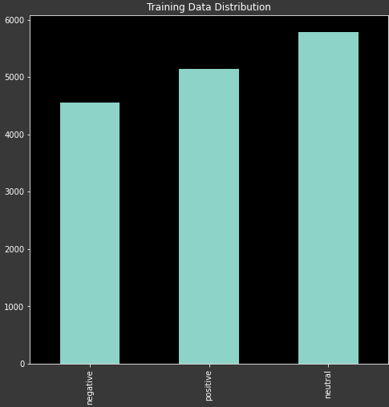

[Competition Link](https://competitions.codalab.org/competitions/20654)

[Preprocessed Training Set](https://drive.google.com/file/d/1VJwEz8Er32HVU9cRT0KE6_aQ57Zk1KHn/view?usp=sharing)

[Preprocessed Test Set](https://drive.google.com/file/d/1fEStOFdGeowWemE0uw_UOm9TfeTcxmbh/view?usp=sharing) 

Introduction
============

Social media environments are inherently multilingual and
non-native English speakers regularly mix other languages with English
in the same utterance[1]. This is a well-known concept in linguistics
called *Code-Mixing*. This implies that the conventional monolingual NLP
systems may and do struggle when working with such data.

This project is geared towards furnishing a reliable *Sentiment
Classification* system for code-mixed tweets written in Hindi and
English. The system shall classify sentences into 3 labels/sentiments:

-   Negative (0)

-   Positive (1)

-   Neutral (2)

More specifically, I've explored the spectrum of fine-tuning pretrained
transformer models i.e. *BERT*. Before transformers, *RNNs* & *LSTMs*
ruled the day and were the linchpin of most NLP tasks. In 2017, however,
Ashish et al. demonstrated to the community that *attention is all you
need[3]. Attention mechanisms, partly because of their ability to
parallelize computations, quickly became the go-to approach for NLP
practitioners.

Another interesting trend emerged with the pretraining of mammoth
transformer models and their subsequent release to the open world.
*BERT* was one in the chain and revolutionized natural language
processing.

BERT
====

*BERT* has been used for a plethora of tasks, one of which is *Sentiment
Classification* and is known to produce appreciable results. It is a
transformer mechanism which has been pretrained on *Masked Language
Modelling* and *Next Sentence Prediction*. Generally, there are two
variants: *base* and *large* with 110M and 340M parameters respectively.
Moreover, many *BERT* derivatives, after either further training or
distillation, have emerged. For our use case, I've used the following:

-   *bert-base-multilingual-cased*

-   *distilbert-base-multilingual-cased*

-   *DeepPavlov/bert-base-multilingual-cased-sentence*

Data
====

Data for this task was graciously provided by the event
organizers[1]. It was just an assortment of code-mixed tweets with
associated sentiment labels. Moreover, each tweet was also broken into
separate tokens and each token was annotated with a language symbol
(Hindi/English). Charted below is the distribution of training data:

Preprocessing
-------------

Since the data is sourced from *twitter*, it obviously suffers from a
lot of noise. I've tried my best to suppress the noise by:

-   Removing URLs

-   Removing Mentions

-   Removing Emojis

-   Removing Numbers

-   Collapsing Spaces

-   Removing Certain Symbols

The mentioned steps did bring down the noise by a good margin and helped
the model generalize better, in effect raising its *F1* score by
$\approx$*0.04*.

Approach
========

The easiest interface to *BERT* I could find was the *transformers* API
by *HuggingFace* and almost every article on *BERT* seemed to be
utilizing that API. In addition to that, all training was conducted on
separate *Google Colab* accounts running in parallel.

Optimizer & Learning Rate
-------------------------

The authors[2] of *BERT* recommend using *AdamW* with one of the
following learning rates: $2\times10^{-5}$, $3\times10^{-5}$,
$5\times10^{-5}$. Each of the learning rates and even more were tested
with *AdamW* multiple times and while it was performing good, it was
unable to cross the *0.7* F1 Score mark.

Another optimizer provided by *transformers* interface was *Adafactor*
which is what slightly bumped up the F1 Score and enabled me to cross
the *0.7* benchmark. A learning rate of $4\times10^{-5}$ seemed to be
yielding the optimal results.

Batch Size
----------

Since our dataset was especially small for a model with 110M parameters,
recommendations around the web (*transformer's* github) centered around
using a small batch size. But I quickly found that out to be false. The
best result was obtained when using a batch size of 96 whereas *BERT's*
authors[2] recommend 16, 32 & 64. I also find that the size of batch
does not contribute to variance in the ultimate score as much as tuning
the learning rate does.

Random Seeds
------------

It might sound like an absurdly stupid idea upfront, but hear me out.
Jonas[4] very clearly establishes with extensive experimentation
that *BERT*, on small datasets, is prone to high variance due to
different random weight initializations and data order. In fact, he
suggests trying to train the model with different random seeds, which is
exactly what I did.

After training almost 30 models, each with a different random seed and
for 4 epochs, a seed of 11 worked out best in my favor. Most seeds would
just saturate the model's performance at an F1 score of $\approx$0.66
while 11 helped bump it up to $\approx$0.705.

Miscellaneous
-------------

Number of warmup steps were set as:

$$0.1\times len(training\_data)$$

In addition, to circumvent the situation of exploding gradients,
gradient clipping was employed with a max norm of 1.

Results
=======

Before we dive right into the results, let's take a look at the F1
scores of the three *BERT* variants I tested:

|BERT Derivative|F1 Score|
|---|---|
|DeepPavlov/bert-base-multilingual-cased-sentence|0.705|
|bert-base-multilingual-cased|0.690|
|distilbert-base-multilingual-cased|0.667|

Although a minor improvement on paper, *DeepPavlov's* BERT is really
crucial for me as it helped me cross into the land of the kings i.e.
achieve more than 0.7 F1 Score. This score was achieved using a batch
size of 96, a learning rate of $4\times10^{-5}$, a gradient clipping max
norm of 1 and a warmup factor of 0.1.

The intention was to train the model for 4 epochs but it began
overfitting the training data only after the 2nd epoch and early
stopping was utilized. Each epoch took approximately 4 minutes to train
on the GPUs provided by *Google Colab*. The best model was available to
yield the following results:

|Label|Precision|Recall|F1 Score|
|---|---|---|---|
|Negative|0.72|0.71|0.71|
|Positive|0.80|0.74|0.77|
|Neutral|0.62|0.66|0.64|

Conclusion
==========

*BERT* is an exceptionally capable pretrained model but its complexity
does bring about a major drawback: a small dataset will have a greater
tendency to overfit. I made use of different dropout probabilities upto
0.5 but the performance did not improve. Data augmentation/collection
was thought of but I never found the time to do it. I had to make do
with early stopping. All in all, if you can employ effective
regularization techniques and posses a good dataset, you can coerce
*BERT* to produce reliable models.

Footnotes
==========

1. Parth Patwa, Gustavo Aguilar, Sudipta Kar et al. *SemEval-2020 Task 9:
Overview of Sentiment Analysis of Code-Mixed Tweets*. 2020.

2. Jacob Devlin, Ming-Wei Chang, Kenton Lee, Kristina Toutanova *BERT:
Pre-training of Deep Bidirectional Transformers for Language
Understanding*. 2019.

3. Ashish Vaswani, Noam Shazeer, Niki Parmar et al. *Attention Is All You
Need*. 2017.

4. Jonas Vetterle *How To Make The Most Out Of BERT Finetuning*. 2019.
Retrieved from
*https://towardsdatascience.com/how-to-make-the-most-out-of-bert-finetuning-d7c9f2ca806c*
